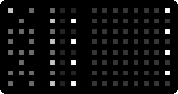

# nydl

nydl is not your dream looper (It might be mine. Time will tell). It's
a New Years Day looper. It's a four-channel beat-synced looper for
Norns and Grid.

## Getting Started

Install nydl, restart Norns. Plug in Grid. Start nydl.

Arrange some sound to go into your Norns, ideally one that is synced
to the Norns clock. Now turn down Norns' own monitor of your
sound. We're going to be monitoring from within the script.

## Grid overview

When you start nydl, your grid will look like this:

To the left, there is the *sigil*. It contains tools for navigating
nydl, and for editing your sound.

In the middle there are per-track tools. Each track is represented by
two rows on the Grid. The left of this section has one manticore and
one mute per track, and the four buttons per-track to the right are
section indicators and selectors.

To the right is your sound, with a button lit up to represent your
playhead.

## The Manticore

In the per-track tools section, the top left button of the
per-track controls for every track (the one that's darker) is the
*manticore* button. Aside from being a mythical creature, this
*manticore* is a portmanteau of "monitor" and "record", and that's
what you'll do with this button.

Press that manticore for a channel, and you should hear your input
monitored on that channel. Press it once more, and it should begin
flashing quickly. The quick flashing indicates you aren't recording
quite yet, but you will be at the next loop point.

Soon the next loop point will arrive, and the manticore will start
breathing, indicating it is recording. It'll do this for one loop, and
then go dark, muting the monitor and replacing it with the recording
you just made. You can always press the manticore again, starting
monitoring for the track again, and pressing it yet again will
overdub.

If you're monitoring and you want to stop monitoring without
recording, long-press the manticore and you'll go back to just playing
the loop.

If you change tempo, monitoring after the change will trigger a
resampling phase for that track. You will be prevented from recording
until the resample is complete. You will be prevented from changing
tempo while monitoring or recording.

## The Mute

The mute button for each track is right under the manticore. It mutes
the recording, but not the monitor. To replace the sound on a track
instead of overdubbing, record to it while the recording is
muted. When the manticore is done recording, along with muting the
monitor, it'll unmute the track for you so it keeps playing
seamlessly.

