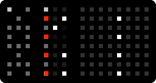
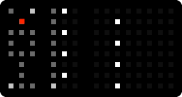

# nydl

nydl (pronounced kind of like a slurred "night owl") is not your dream looper
(It might be mine. Time will tell). It's a New Years Day looper. It's a
four-channel beat-synced looper and plock (parameter-lock) sequencer for Norns
and (recommended) Grid.

## Getting Started

Install nydl, restart Norns. Plug in Grid, or not. Start nydl.

Arrange some sound to go into your Norns, ideally one that is synced
to the Norns clock. Now turn down Norns' own monitor of your
sound. We're going to be monitoring from within the script.

## Teal Deer

When you start nydl, Norns will show each track: The sound is represented by a
graph of its amplitude above, and the sequence is represented below that. The
looped part of the sequence is brighter, and any plocks are yet brighter.

**e1** - Track select

**e2** - Function select for e3, k3

**e3** - Varies. Look at the screen to see what it does.

**k1** - Norns menu as usual. Peep the params.

**k2** - Manticore. Use to monitor and record for the selected track.

**k3** - Varies. Look at the screen to see what it does.

When you start nydl, your grid will look like this:

To the left, there is the *sigil*. It contains tools for navigating nydl, and
for editing your sound. The top two buttons of it change between edit and cue
modes. In edit mode you record sounds and select steps or ranges of steps and
apply tools to them. In cue mode you skip around in your sound and apply tools
to the current location of the playhead, and you can record these cues as
plocks.

In the middle there are per-track tools. Each track is represented by
two rows on the Grid. The left of this section has one manticore and
one mute per track, and the four buttons per-track to the right are
section indicators and selectors.

To the right is your sound, with a button lit up to represent your
playhead.

## The Manticore

In the per-track tools section of the grid, the top left button of the per-track
controls for every track (the one that's dancing with the beat a little bit) is
the *manticore* button. On Norns itself, K2 is the *manticore* button for the
selected track.

Aside from being a mythical creature, this *manticore* is a
portmanteau of "monitor" and "record", and that's what you'll do with
this button.

Press that manticore for a channel, and you should hear your input
monitored on that channel. Press it once more, and it should begin
flashing quickly. The quick flashing indicates you aren't recording
quite yet, but you will be at the next loop point.

Soon the next loop point will arrive, and the manticore will start
breathing, indicating it is recording. It'll do this for one loop, and
then go dark, muting the monitor and replacing it with the recording
you just made. You can always press the manticore again, starting
monitoring for the track again, and pressing it yet again will
overdub.

If you're monitoring and you want to stop monitoring without
recording, long-press the manticore and you'll go back to just playing
the loop.

If you change tempo, monitoring after the change will trigger a
resampling phase for that track. You will be prevented from recording
until the resample is complete. You will be prevented from changing
tempo while monitoring or recording.

## The Mute

The mute button for each track is right under the manticore. It mutes
the recording, but not the monitor. To replace the sound on a track
instead of overdubbing, record to it while the recording is
muted. When the manticore is done recording, along with muting the
monitor, it'll unmute the track for you so it keeps playing
seamlessly.

## Edit vs. Cue

The first row of the sigil selects the mode for the grid. The meaning
of "recording" and "monitoring" are different in each mode. The two
modes have independent monitoring status, and you can't switch modes
while recording.

**Edit mode** The top left button selects *edit mode*.

  In edit mode, monitoring monitors the input sound.

  In edit mode, recording records the input sound.

  In edit mode, the right half of the grid represents steps in a sequence, each
  of which may contain a parameter lock; lockable parameters include a buffer
  position to jump to, a rate to play at, a rate to stutter the loop at, or
  effect application. You have 64 steps in your sequence, available 16 steps at
  a time on 4 pages. The pages are accessed in the middle section of the
  grid. In edit mode you can select one or more steps by pressing a range of
  buttons on a track, and then press the button for a tool on the sigil,
  applying that tool to that range of steps. It also works to press a page
  button or a range of page buttons; this will apply the tool to the whole page.

**Cue mode** The button on the other side of the sigil from the edit
  mode button is the cue mode button.

  In cue mode, monitoring determines which tracks your tools from the sigil will
  be applied to, and which tracks are available for cueing. Cue mode does very
  little until you push a manticore.

  In cue mode, recording records your series of cues into the sequence,
  quantized to the step size.

  In cue mode, the right half of the grid represents your sound. If you have a
  sequence with jumps, you'll see the playhead jump to follow the sequence. You
  can cue specific slices (on a track you're monitoring) by pressing buttons or
  ranges of buttons. Pressing sigil buttons cues their effects wherever the
  playhead currently is. When you release all buttons, nydl resumes playing your
  regularly scheduled sequence.

## The Sigil

The sigil is full of tools, and it looks slightly different between edit and cue
modes. Here's a rundown.

### Stall

Brings the playhead rate to zero, but slowly. Has a kind of record-scratch feel
to it. In edit mode the time it takes to reach stillness is the selected number
of steps; in cue mode it's chosen by the bottom three buttons of the sigil.

### Fx

Three different effects:

* Bitcrushing
* Filter (check parameters to pick bandpass/lowpass/highpass)
* Delay send

### Rate

Change the rate of the playhead. Left is slow; right is fast.

### Stutter

Replace the selected time with the first part of it, repeated:

* 2x
* 3x
* 4x

The "selected time" in cue mode is chosen by the buttons at the bottom of the
sigil.

### Reverse

Reverses the selected time (edit mode) or the playhead for as long as its held
down (cue mode).

### Cut, Copy, Paste

Only in edit mode. Manipulates the sequence, and also a clipboard like it's a
real computer. Note that "cut" doesn't remove sound, it removes plocks from the
sequence. It's extra valuable that way - it's your only way of removing plocks
from the sequence.

### Select

Edit mode only. Makes your selection "sticky" so you can apply and un-apply tools to the same
section of the tracks easily. Press it again without any steps held to clear a
sticky selection.

### Loop

Edit mode only. Loops the selected section of the sequence.

### Jump to normal

Only in cue mode. Jump to the position in the sound corresponding to the current
step in the sequence, and set the playback rate to normal speed. Prevents the
plocks from the sequence from taking effect, though other manual cues will still
work.

### Time for effects

Sets the time-base for stall and stutter:

* 4 steps
* 2 steps
* 1 step

### Mute

The mute buttons can also be used like a "tool": Muting and unmuting the track
is recorded as mute plocks in cue mode, and if you hit the mute button for a
track in edit mode *while holding down* a range of steps it'll mute those steps
in the sequence.

## Tips.

* Use the parameter menu to load a file into a track, or save your whole project
  to a pset (and some files with sequences and sounds on the side).

* You can also access longer recording times from the parameters menu, though
  your sequence is always 64 steps long. You can record as much as 16 bars, with
  quarter-note steps.

* Record different things to each of the four sections of a track. Use the loop
  tool to jump between them.

* Mute a track in cue mode, but activate its monitor. Playing slices of it will
  "break through" the mute, allowing for finger-drumming styles.